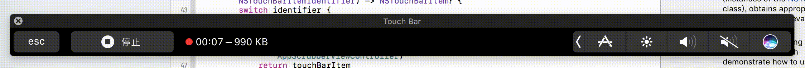
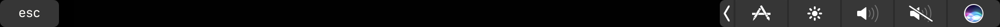

# TouchDock

Dock on your Touch Bar!

## Installation

You can download ZIP from [releases](https://github.com/ddddxxx/TouchDock/releases).

### Requirements

- macOS 10.13+
- MacBook Pro with Touch Bar

## Screenshot

## License

TouchDock is available under the GNU General Public License v3.0. See the [LICENSE file](LICENSE).
